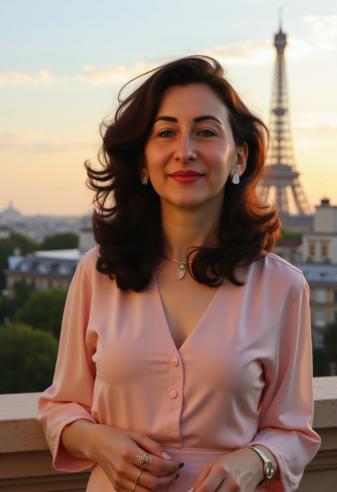

<html lang="pt-br">
<head>
  <meta charset="utf-8" />
  <meta name="viewport" content="width=device-width, initial-scale=1" />

  <title>Mentoria ALANC — Alavancagem de Carreira e Negócios</title>
  <meta name="description" content="Mentoria ALANC: alavancagem de carreira e negócios com clareza, propósito e equilíbrio. Para mulheres e casais que querem prosperar sem abrir mão da família.">
  <meta name="robots" content="index,follow">

  <!-- Open Graph / Twitter -->
  <meta property="og:type" content="website">
  <meta property="og:title" content="Mentoria ALANC — Clareza, Propósito e Equilíbrio">
  <meta property="og:description" content="Alavanque sua carreira e seus negócios sem abrir mão da família, do equilíbrio e do propósito.">
  <meta property="og:image" content="logo.jpeg">
  <meta property="og:locale" content="pt_BR">
  <meta name="twitter:card" content="summary_large_image">

  <link rel="preconnect" href="https://fonts.googleapis.com">
  <link href="https://fonts.googleapis.com/css2?family=Inter:wght@400;600;800;900&display=swap" rel="stylesheet">

  
</head>
<body>

  <!-- Cabeçalho -->
  
Mentoria ALANC — Alavancagem de Carreira e Negócios

  <!-- HERO -->
  <section class="hero" aria-labelledby="titulo-hero">
    

      

        
        <h1 id="titulo-hero">Alavancagem de Carreira e Negócios com Clareza, Propósito e Equilíbrio</h1>
        
<strong>Alavanque sua carreira e seus negócios sem abrir mão da família, do equilíbrio e do propósito.</strong> A Mentoria ALANC é para mulheres e casais que sabem que podem mais, mas não querem crescer sozinhos.

        

        

          <a class="btn primary" href="https://forms.gle/3KbznEmAkpgoNaab9" target="_blank" rel="noopener">Quero entrar na Mentoria ALANC</a>
          <a class="btn ghost" href="#faq">Perguntas frequentes</a>
        

      

    

  </section>

  <!-- Quem sou eu -->
  <section id="quem-sou" aria-labelledby="t-quem">
    

      <h2 id="t-quem" class="section-title">Quem Sou Eu</h2>
      

        
        

          <h3 class="grad-left">Alinne de Pasinatto</h3>
          
Fundadora da Mentoria ALANC, contadora de formação, autora do livro <em>8 Habilidades de um Líder Extraordinário</em> e especialista em desenvolvimento pessoal, empresarial e constelação organizacional.

          
Comecei cedo, vendendo roupas e cosméticos aos 16 anos, enfrentei dores profundas na minha família de origem e precisei assumir responsabilidades antes da hora. Transformei essas experiências em força e, com disciplina e conhecimento, criei empresas, escrevi um livro e hoje ajudo mulheres e casais a prosperarem sem perder o que realmente importa: a essência e a família.

          

            <a class="btn primary" href="https://forms.gle/3KbznEmAkpgoNaab9" target="_blank" rel="noopener">Aplicar para a Mentoria</a>
          

        

      

    

  </section>

  <!-- Rodapé -->
  <footer>
    © Mentoria ALANC — Todos os direitos reservados.
  </footer>

  <!-- Botão flutuante WhatsApp -->
  <a class="whats-float" href="https://wa.me/5549999726831?text=Quero%20saber%20mais%20sobre%20a%20Mentoria%20ALANC" target="_blank" rel="noopener">
    <svg viewBox="0 0 24 24"><path d="M20.5 3.5A10 10 0 0 0 3.2 17.7L2 22l4.4-1.2A10 10 0 1 0 20.5 3.5Zm-8.4 2.2c4.1 0 7.4 3.3 7.4 7.4a7.4 7.4 0 0 1-10.1 6.8l-.3-.1-2.6.7.7-2.5-.1-.3a7.4 7.4 0 0 1 5-11.9Zm4.2 9.8c-.2.6-1.1 1-1.5 1.1-.4.1-.9.1-1.5 0s-1.5-.5-2.6-1.1c-1-.6-1.8-1.6-2.1-2.1-.3-.5-.5-1.3-.1-1.9.2-.3.5-.8.8-.8h.6c.1 0 .4-.1.6.5.2.6.8 2 .9 2.2.1.2.1.4 0 .6s-.2.4-.4.6c-.2.2-.4.4-.2.7.2.3.9 1.4 2.1 2 .9.5 1.6.6 1.9.4.3-.2.4-.5.6-.8.2-.3.5-.4.8-.3l1.9.9c.3.1.5.3.6.5Z"/></svg>
  </a>

  <!-- JS FAQ -->
  
</body>
</html>
