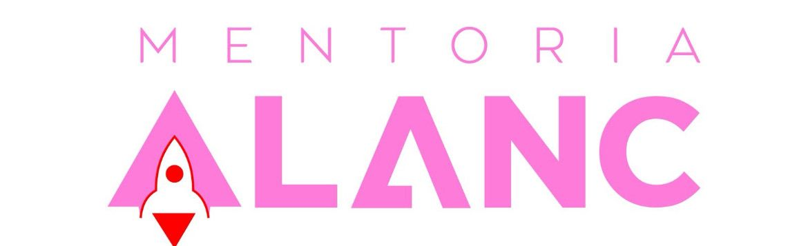

<html lang="pt-br">
<head>
  <meta charset="utf-8" />
  <meta name="viewport" content="width=device-width, initial-scale=1" />

  <title>Mentoria ALANC — Alavancagem de Carreira e Negócios</title>
  <meta name="description" content="Mentoria ALANC: alavancagem de carreira e negócios com clareza, propósito e equilíbrio. Para mulheres e casais que querem prosperar sem abrir mão da família.">
  <meta name="robots" content="index,follow">

  <!-- Open Graph / Twitter -->
  <meta property="og:type" content="website">
  <meta property="og:title" content="Mentoria ALANC — Clareza, Propósito e Equilíbrio">
  <meta property="og:description" content="Alavanque sua carreira e seus negócios sem abrir mão da família, do equilíbrio e do propósito.">
  <meta property="og:image" content="logo.jpeg">
  <meta property="og:locale" content="pt_BR">
  <meta name="twitter:card" content="summary_large_image">

  <link rel="preconnect" href="https://fonts.googleapis.com">
  <link href="https://fonts.googleapis.com/css2?family=Inter:wght@400;600;800;900&display=swap" rel="stylesheet">

  
</head>
<body>

  <!-- Cabeçalho -->
  
Mentoria ALANC — Alavancagem de Carreira e Negócios

  <!-- HERO -->
  <header class="hero" aria-labelledby="titulo-hero">
    

      

        
        <h1 id="titulo-hero">Alavancagem de Carreira e Negócios com Clareza, Propósito e Equilíbrio</h1>
        
<strong>Alavanque sua carreira e seus negócios sem abrir mão da família, do equilíbrio e do propósito.</strong> A Mentoria ALANC é para mulheres e casais que sabem que podem mais, mas não querem crescer sozinhos.

        

        

          <a class="btn primary" href="https://forms.gle/3KbznEmAkpgoNaab9" target="_blank" rel="noopener" aria-label="Abrir formulário de aplicação em nova guia">Quero entrar na Mentoria ALANC</a>
          <a class="btn ghost" href="#faq">Perguntas frequentes</a>
        

      

    

  </header>

  <!-- Identificação com a dor -->
  <section id="dor" aria-labelledby="t-dor">
    

      <h2 id="t-dor" class="section-title">Você já se pegou pensando…</h2>
      

        <ul class="list-dot">
          <li>“Quero empreender, mas tenho medo de arriscar.”</li>
          <li>“Me sinto presa em uma rotina que não faz mais sentido.”</li>
          <li>“Carrego a culpa de não dar conta da família e do trabalho.”</li>
          <li>“Tenho potencial, mas não sei qual o próximo passo certo.”</li>
        </ul>
        
<strong> Não é falta de esforço.</strong> É falta de clareza, método e apoio certo.

      

    

  </section>

  <!-- Transformação prometida -->
  <section id="transformacao" aria-labelledby="t-transf">
    

      <h2 id="t-transf" class="section-title">A transformação que você leva</h2>
      

        

          <h3 class="grad-left">Estratégia & Clareza</h3>
          <ul class="list-check">
            <li>Estruturar seu negócio com clareza e estratégia.</li>
            <li>Alinhar propósito, família e prosperidade — sem abrir mão de nenhum.</li>
          </ul>
        

        

          <h3 class="grad-left">Confiança & Método</h3>
          <ul class="list-check">
            <li>Superar bloqueios emocionais e crenças limitantes.</li>
            <li>Alavancar vendas com método prático e consistente.</li>
            <li>Construir um negócio com alma e impacto real, com Constelação Empresarial como base.</li>
          </ul>
        

      

    

  </section>

  <!-- Quem sou eu -->
  <section id="quem-sou" aria-labelledby="t-quem">
    

      <h2 id="t-quem" class="section-title">Quem Sou Eu</h2>
      

        
        

          <h3 class="grad-left">Alinne de Pasinatto</h3>
          
Fundadora da Mentoria ALANC, contadora de formação, autora do livro <em>8 Habilidades de um Líder Extraordinário</em> e especialista em desenvolvimento pessoal, empresarial e constelação organizacional.

          
Comecei cedo, vendendo roupas e cosméticos aos 16 anos, enfrentei dores profundas na minha família de origem e precisei assumir responsabilidades antes da hora. Transformei essas experiências em força e, com disciplina e conhecimento, criei empresas, escrevi um livro e hoje ajudo mulheres e casais a prosperarem sem perder o que realmente importa: a essência e a família.

          

            <a class="btn primary" href="https://forms.gle/3KbznEmAkpgoNaab9" target="_blank" rel="noopener">Aplicar para a Mentoria</a>
          

        

      

    

  </section>

  <!-- Para quem é -->
  <section id="publico" aria-labelledby="t-publico">
    

      <h2 id="t-publico" class="section-title">Para quem é a Mentoria ALANC</h2>
      

        <ul class="list-check">
          <li>Mulheres em transição de carreira que desejam criar negócios prósperos.</li>
          <li>Casais que querem alinhar vida, propósito e empresa.</li>
          <li>Empreendedores(as) com negócio ativo que querem destravar vendas e crescer.</li>
          <li>Profissionais que desejam transformar carreira em propósito.</li>
        </ul>
      

    

  </section>

  <!-- Benefícios reais -->
  <section id="beneficios" aria-labelledby="t-beneficios">
    

      <h2 id="t-beneficios" class="section-title">Benefícios Reais</h2>
      

        

          <h3 class="grad-left">Clareza do próximo passo</h3>
          
Avançar sem medo de errar.

        

        

          <h3 class="grad-left">Equilíbrio</h3>
          
Negócios e família convivendo com leveza.

        

        

          <h3 class="grad-left">Vendas com propósito</h3>
          
Comunicação segura e alinhada a valores.

        

        

          <h3 class="grad-left">Negócio com alma</h3>
          
Impacto real, conectado à sua história.

        

      

    

  </section>

  <!-- Depoimentos (somente rosa) -->
  <section id="depoimentos" aria-labelledby="t-dep">
    

      <h2 id="t-dep" class="section-title">Depoimentos Reais de Transformação</h2>
      

        <article class="t-card" aria-label="Depoimento de Joel Souza – Terapeuta">
          
Joel Souza – Terapeuta

          
“A minha maior trava estava em como vender meu produto e como ser o profissional que me tornei hoje. Com a Mentoria ALANC venci bloqueios, medos e desafios de aparecer. Já estou há cinco meses fora da CLT, atuando com segurança. Essa mentoria fortaleceu minhas crenças positivas e me ajudou a vencer as limitantes sobre ser empresário.”

        </article>
        <article class="t-card" aria-label="Depoimento de Amanda Aragão">
          
Amanda Aragão — Dentista e empresária

          
“O processo de mentoria foi um divisor de águas na minha transição para o empreendedorismo. Mais do que clareza profissional, me trouxe leveza emocional e entendimento profundo sobre mim mesma. Hoje me sinto mais preparada, leve e com direção clara para conquistar o que está por vir.”

        </article>
        <article class="t-card" aria-label="Depoimento de Joice e Adriano">
          
Joice e Adriano — empresária

          
“Após trabalharmos o fluxo de caixa a minha empresa mudou completamente. Abrimos espaço para novos clientes do perfil certo, fechamos vários orçamentos e o fluxo de caixa melhorou muito.”

        </article>
        <article class="t-card" aria-label="Depoimento de Juciele Cadore">
          
Juciele Cadore — empresária

          
“A cada encontro é uma nova descoberta, um aprendizado único e maravilhoso. A mentoria transformou minha vida! Todo investimento que fazemos em nós mesmos retorna em dobro.”

        </article>
        <article class="t-card" aria-label="Depoimento de Alini de Paris">
          
Alini de Paris — Consultora financeira

          
“Antes da Mentoria ALANC eu estava cheia de dúvidas: carreira, vida pessoal e até sobre mim mesma. Trabalhei minhas emoções, ganhei clareza e confiança. Fiz uma transição segura e alinhada ao que eu realmente queria.”

        </article>
      

    

  </section>

  <!-- Diferenciais -->
  <section id="diferenciais" aria-labelledby="t-dif">
    

      <h2 id="t-dif" class="section-title">Por que a Mentoria ALANC é Diferente?</h2>
      

        
<strong>Estratégia de negócios + Constelação empresarial + Inteligência emocional.</strong> Você não aprende só a vender. Aprende a crescer com equilíbrio, respeitando sua história, seu propósito e a sua família.

      

    

  </section>

  <!-- FAQ -->
  <section id="faq" aria-labelledby="t-faq">
    

      <h2 id="t-faq" class="section-title">Perguntas Frequentes</h2>
      

        

          <button class="faq-q" aria-expanded="false">Como faço minha aplicação?+</button>
          

            Clique em <strong>“Quero entrar na Mentoria ALANC”</strong>. O formulário abre em nova guia para você preencher.
          

        

        

          <button class="faq-q" aria-expanded="false">Para quem é a mentoria?+</button>
          

            Mulheres em transição, casais empreendedores, quem já tem negócio e quer destravar vendas, e profissionais que buscam propósito na carreira.
          

        

        

          <button class="faq-q" aria-expanded="false">Preciso ter empresa aberta?+</button>
          

            Não. O importante é compromisso com um caminho prático, sustentável e alinhado aos seus valores.
          

        

        

          <button class="faq-q" aria-expanded="false">Qual é a abordagem de trabalho?+</button>
          

            Método de gestão e vendas somado à Constelação Empresarial e desenvolvimento emocional para decisões maduras e consistentes.
          

        

      

    

  </section>

  <!-- CTA final -->
  <section aria-labelledby="t-cta" style="padding:32px 0">
    

      

        

          
Pronta(o) para alavancar?

          <h3 id="t-cta" style="margin:6px 0 0;font-size:22px;color:var(--ink)">Agora é a sua vez de crescer com clareza, propósito e equilíbrio.</h3>
        

        

          <a class="btn primary" href="https://forms.gle/3KbznEmAkpgoNaab9" target="_blank" rel="noopener" aria-label="Abrir formulário de aplicação">Fazer minha aplicação</a>
          <a class="btn ghost" href="https://wa.me/5549999726831?text=Quero%20saber%20mais%20sobre%20a%20Mentoria%20ALANC" target="_blank" rel="noopener">Falar no WhatsApp</a>
        

      

    

  </section>

  <!-- Rodapé -->
  <footer role="contentinfo">
    © Mentoria ALANC — Todos os direitos reservados.
  </footer>

  <!-- Botão flutuante WhatsApp -->
  <a class="whats-float" href="https://wa.me/5549999726831?text=Quero%20saber%20mais%20sobre%20a%20Mentoria%20ALANC" 
     target="_blank" rel="noopener" aria-label="Falar no WhatsApp">
    <svg viewBox="0 0 24 24" aria-hidden="true">
      <path d="M20.5 3.5A10 10 0 0 0 3.2 17.7L2 22l4.4-1.2A10 10 0 1 0 20.5 3.5Zm-8.4 2.2c4.1 0 7.4 3.3 7.4 7.4a7.4 7.4 0 0 1-10.1 6.8l-.3-.1-2.6.7.7-2.5-.1-.3a7.4 7.4 0 0 1 5-11.9Zm4.2 9.8c-.2.6-1.1 1-1.5 1.1-.4.1-.9.1-1.5 0s-1.5-.5-2.6-1.1c-1-.6-1.8-1.6-2.1-2.1-.3-.5-.5-1.3-.1-1.9.2-.3.5-.8.8-.8h.6c.1 0 .4-.1.6.5.2.6.8 2 .9 2.2.1.2.1.4 0 .6s-.2.4-.4.6c-.2.2-.4.4-.2.7.2.3.9 1.4 2.1 2 .9.5 1.6.6 1.9.4.3-.2.4-.5.6-.8.2-.3.5-.4.8-.3l1.9.9c.3.1.5.3.6.5Z"/>
    </svg>
  </a>

  <!-- JS do FAQ (abre um por vez + ARIA) -->
  
</body>
</html>
